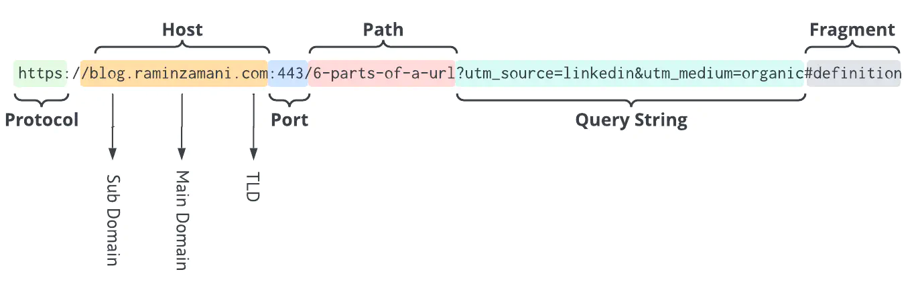

# ukma_url_parser
This Rust project provides functionality for parsing URLs and their components (such as protocol, domains, parameters, etc.) using the rust-peg library. It is designed for analyzing parts of a URL.

## Description of the parsing process
A URL (Uniform Resource Locator) is the address of a unique resource on the internet. It is one of the key mechanisms used by browsers to retrieve resources such as HTML pages, CSS documents, images, and more.
This library parses URL parts step-by-step, so it is crucial to understand the structure of a URL:



<dl> 
<dt>
Scheme (protocol)
</dt>
<dd>
The scheme identifies the protocol to be used to access the resource on the Internet. It can be HTTP (without SSL), HTTPS (with SSL),
FTP and so on. 
URI schemes registered with the IANA, both provisional and fully approved, are listed in its registry for Uniform Resource Identifier (URI) Schemes. These include well known ones like:

* file - File URI scheme
* ftp – File Transfer Protocol
* http – Hypertext Transfer Protocol
* https – Hypertext Transfer Protocol Secure
* imap – Internet Message Access Protocol
* irc – Internet Relay Chat
* nntp – Network News Transfer Protocol

As well as many lesser known schemes like:

* acap – Application Configuration Access Protocol
* icap – Internet Content Adaptation Protocol
* mtqp – Message Tracking Query Protocol (RFC3887)
* wss – Encrypted WebSocket connections

A scheme is required for a URL address.

**Technical aspects of parsing:**

For parsing purposes, created an enum of all official protocols and method that returns their string value.
The first rule of this parser checks whether a provided string is a valid URL scheme. It is important to mention, that URL scheme is case insensitive.
</dd>

<dt>
Domain name
</dt>
<dd>
The domain name is the key part of the website address that tells you who is responsible for the content 
and ultimately whether it is legitimate or not. The domain name can have a list of subdomains, separated by a point.
The examples of a domain name: google.com, distedu.ukma.edu.ua.

**Technical aspects of parsing:**

A domain name is required for a URL address. A label is a part of a domain name, separated by a dot ("."). For simplicity, domain names and subdomains are parsed into a general vector as string values.
</dd>

<dt>
Port
</dt>
<dd>
A port number is a means of identifying an application or service on a server to which a message that comes over a network is to be forwarded.
The URL address with port example: http:://localhost:80.

**Technical aspects of parsing:**

A port number is a 16-bit unsigned integer that ranges from 0 to 65535. So this is how it is parsed.
A port value separated from a domain value by a colon.
A port can be optional.
</dd>

<dt>
Path
</dt>
<dd>
The URL path represents the portion of the web address after the top-level domain. It includes the subdirectory and slug(s), giving the specific location of a page within the website's hierarchy.

**Technical aspects of parsing:**

The path can be optional. It is stored as list of strings.
Example: /page/new/3
</dd>

<dt>
Parameters
</dt>
<dd>
(also known as “query strings”) are a way to structure additional information for a given URL. Parameters are added to the end of a URL after a ‘?’ symbol, and multiple parameters can be included when separated by the ‘&’ symbol.
Parameters can be optional.
Example: ?color=red&page=2

**Technical aspects of parsing:**

Parameters are parsed as hashmap with key value structure (Key and value are strings).
</dd>

<dt>
Fragment
</dt>
<dd>
A string of characters that refers to a resource that is subordinate to another, primary resource. The primary resource is identified by a Uniform Resource Identifier (URI), and the fragment identifier points to the subordinate resource.
Fragment can be optional. The example of fragment: #fragment

**Technical aspects of parsing:**

It is parsed as a usual string/
</dd>
</dl>
The task is to create a parser that can understand all these optional and required parts of a URL and store them in a specific Rust structure.

## Useful commands (using Makefile)

### Run a project with a test file (urls.txt)

```
make run
```

### Run tests

```
make test
```

### Format code

```
make fmt
```

### Analyse code

```
make clippy
```

### Open docs

```
make doc
```

### Get help

```
make help
```

## Result example
### Reading urls from urls.txt


